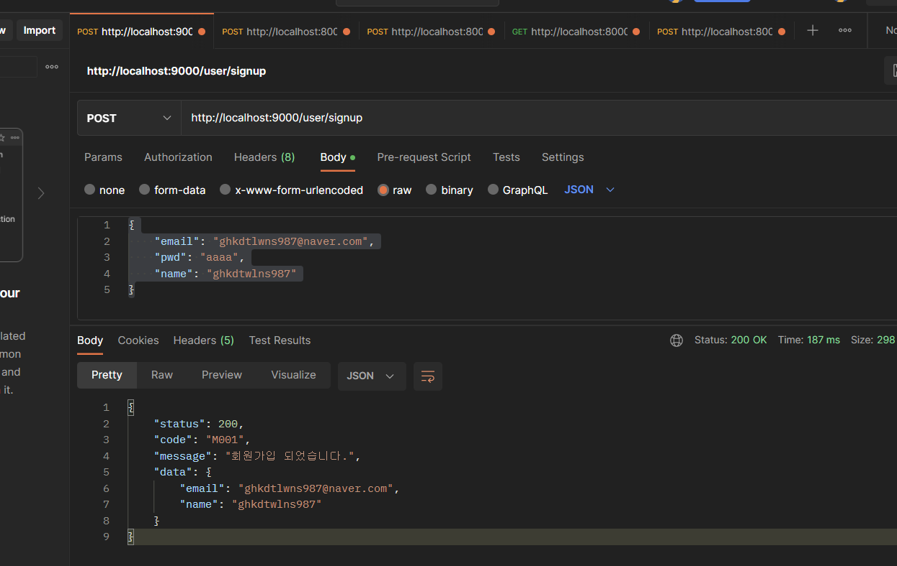
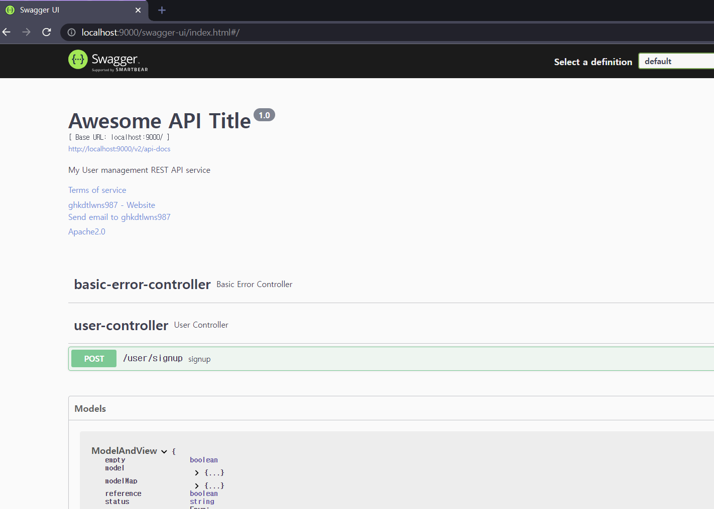

# AMD Project - Backend

> Spring Backend
## 기능  
 > - CRUD(진행중)
 > - 게시판
 > - 파일 업로드
 > - 모델 요청 정보 처리

## 진행사항
> - User Create(signup Method - POST)(FIN)

## Version
> openjdk-11-jdk

## 테스트
> - http://localhost:9000/user/signup


## 참고 사항
> - port : 9000
> - h2-console : http://localhost:9000/h2-console
> - h2-console ID : sa
> - h2-console PW : None

## 버전정보(Swagger)
> http://localhost:9000/swagger-ui/index.html


## Build-Script
```mvn spring-boot:run```